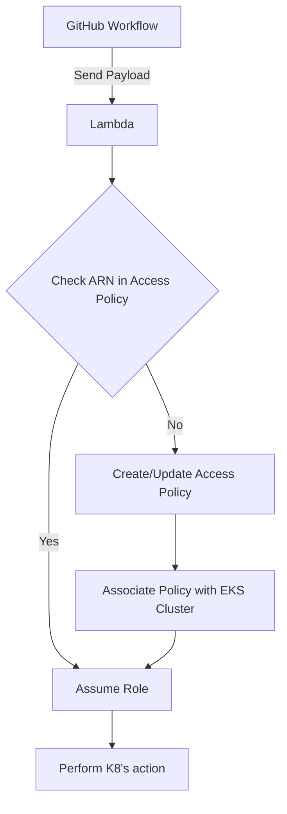

# EKS Manager

Intented use for this lambda and IaC is to manage and enforce required daemonsets/pods for all EKS clusters within an org. Right now `index.py` is only listing pods but it can easily be swapped for a deployment/daemonset.



## Notes

- It is extremely difficult to install aws CLI in a native python Lambda. AWS CLI is required since EKS does not have an equivalent API endpoint for `aws eks get-token --cluster-name my-eks-cluster` which is required in order to assume a role in another account and access the K8s control-plane/resources. [This article](https://amod-kadam.medium.com/how-does-kubeconfig-works-with-aws-eks-get-token-8a19ff4c5814) goes more in depth on why we need the token.

- This container works on the assumption it can leverage [EKS access policies](https://aws.amazon.com/blogs/containers/a-deep-dive-into-simplified-amazon-eks-access-management-controls/) to gain access to a cluster to perform list/deployment options

### CW Tail

```bash
aws logs tail /aws/lambda/jmarter-eks-test--follow
```

### trigger lambda

```bash
aws lambda invoke \
 --function-name jmarter-eks-test \
 --cli-binary-format raw-in-base64-out \
 --payload '{
   "cluster_name": "jmarter-test-cluster",
   "region": "us-east-1",
   "role_to_assume": "arn:aws:iam::123456789012:role/your-target-role",
   "namespace": "default"
 }' \
 /dev/stdout
```

### Docker rebuild (take note of platform for mac '--platform linux/arm64'):

```bash
docker build  -t eks-cluster-manager .
docker tag eks-cluster-manager:latest 123456789012.dkr.ecr.us-east-1.amazonaws.com/eks-cluster-manager:latest
docker push 123456789012.dkr.ecr.us-east-1.amazonaws.com/eks-cluster-manager:latest
terraform apply

aws lambda update-function-code \
  --function-name jmarter-eks-test \
  --image-uri 123456789012.dkr.ecr.us-east-1.amazonaws.com/eks-cluster-manager:latest
```

### create test cluster

```bash
eksctl create cluster -f dev-cluster-config.yaml
```

# TODO:

1. lock down assumable role in target account permissions
2. deploy assumable role in all target accounts
3. create trust policy for assumable role
4. add and test private link functions for private clusters
5. add queuing service for new and existing clusters (cane take 30min+ for new cluster to be created)
6. add worker node checks for new and existing clusters (can create control plane w/o workers to schedule pods on)
7. test multi-region
8. add Makefile for CW + rebuild steps
